# Hosting a webmap with GitHub
As is, your webmap is a folder of files on your computer. You can open it locally, but no one else can access it unless you send them the folder to download to their own computer. This is where web hosting platforms come in. If you upload this folder to a cloud service then you can make the map viewable in web browsers anywhere with internet connection (and no access restrictions). 

If you have a website and access to local server, that's an option too. However, if not, [GitHub](https://github.com/){:target="_blank"} is a low-barrier solution. GitHub is an internet hosting service that allows you to upload files into a repository, or project folder, where they can be shared and collaboratively tracked and edited by a team. This makes it quite popular amongst code developers. Conventionally, you'd work between your local computer and the web account, tracking changes as you go with *git*, a file control software. (See the Research Common's [introduction to git and GitHub](https://ubc-library-rc.github.io/intro-git/){:target="_blank"} for more.) However, we can work directly and exclusively from the web interface. The steps to host your dynamic on the web using GitHub are as follows:

1. Create a free GitHub account
2. Make a new repository 
3. Upload your data folder to the repository
4. Create an index file
5. Generate a GitHub page

----

## 1. Create a Github account
{: .no_toc}
Go to [github.com](https://github.com/){:target="_blank"} and create a free Github account if you haven't already. 


## 2. Make a new repository
{: .no_toc}
Once you've made an account, go to **Repositories**.  

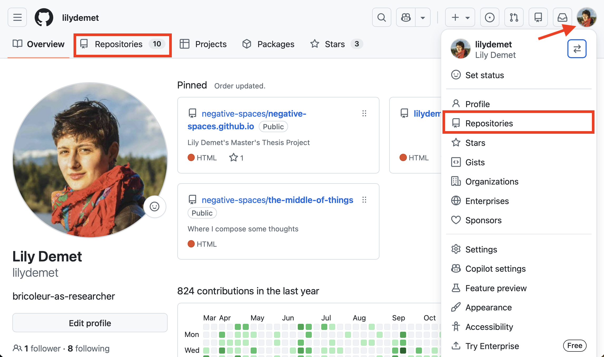

**Create a new repository** (also known as a "repo"). A repository is like a folder that contains a project. 

> - Call the repository `webmapping` followed by your initials.

> - Set the visibility to **Public**.

> - Add a README.md. This is where you can give a brief description of what the project is, and credit your data sources.

>- When working on your own projects, if you choose to set a license at this stage, ensure you have permissions to use all the data you do in the way you are licensing it. Never upload confidential datasets to a publicly visible Github repository. 

> - Scroll down to the bottom and **Create repository**.

> 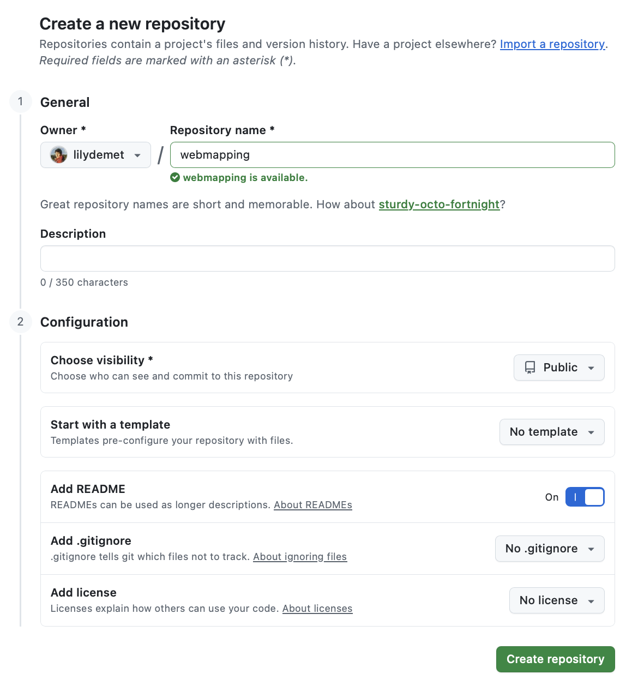


## 3. Upload files to your repository
{: .no_toc}

IMPORTANT: We will be uploading the ***contents*** of the `leaflet-webmapping` subfolder only. Not the entire folder. ***See below if you are uploading an entire folder, such as is the case when hosting a webmap made with qgis2web***.

<!-- before uploading your webmap folder, delete the numbers trailing the name so that the folder is now named only `qgis2web`.  -->

> - Drag and drop the ***contents*** of the `leaflet-webmapping` subfolder. 

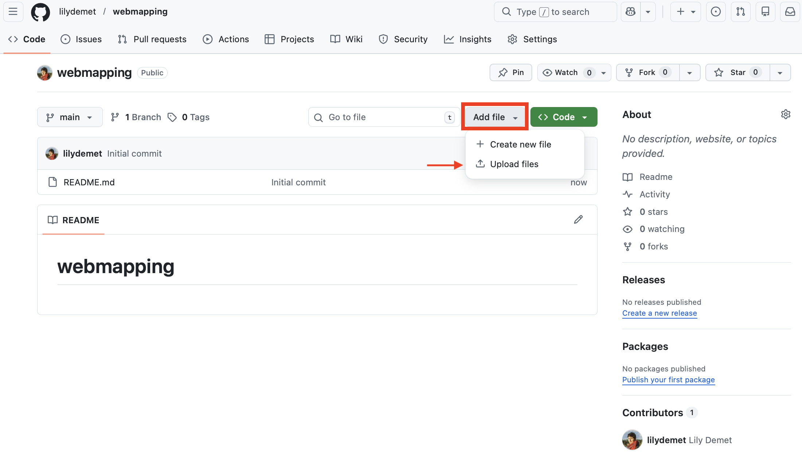
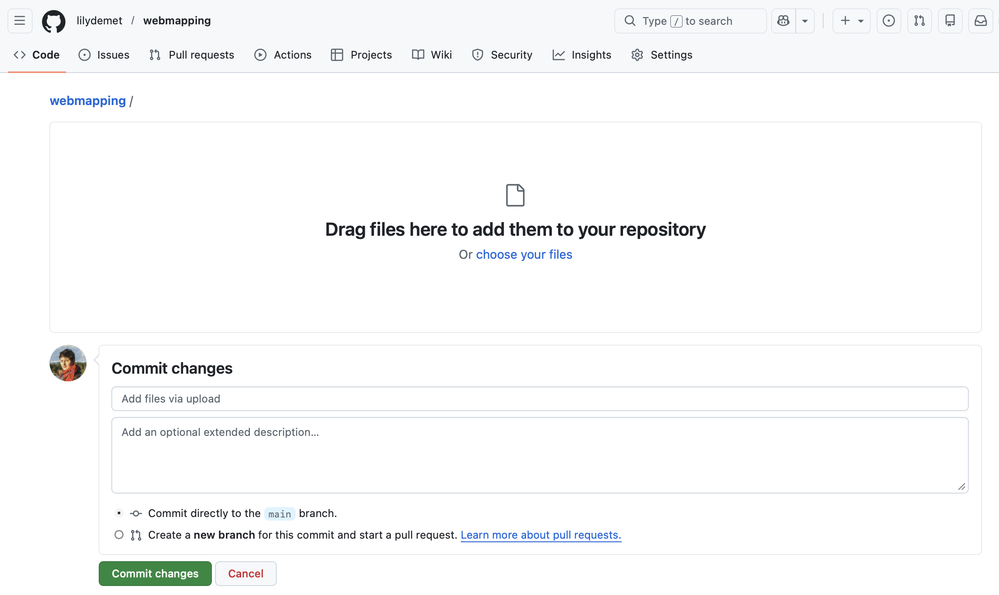
<br>

> - Once uploaded, scroll down to bottom of screen and commit changes. The default message "Add files via upload" is fine. 

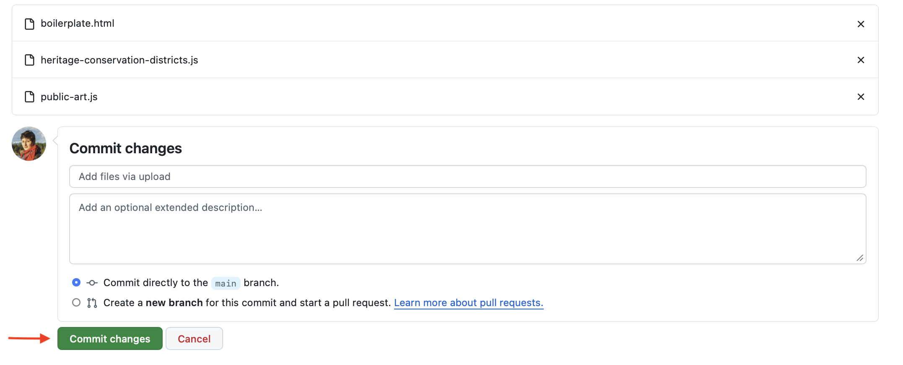
<br>

You should now see your file in your repository:

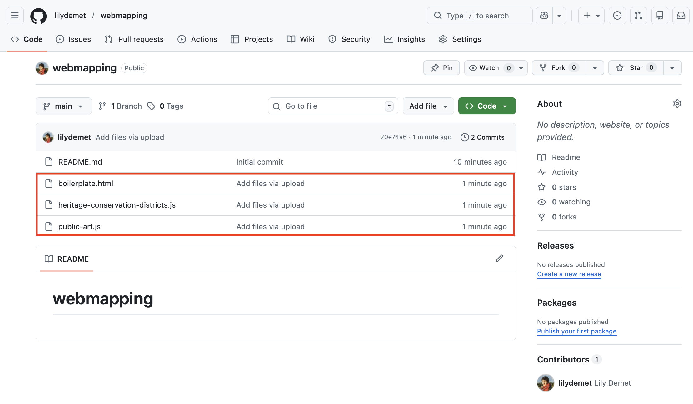


## 4. Create an **`index.html`** file
{: .no_toc}
Since you can upload all sorts of files and code documents to GitHub, in order for it to render your map as the default landing page when you generate a website from this repository, we need to rename `boilerplate.html` to `index.html`. 

>Click the file `boilerplate.html` to navigate into it. You'll see the same code you were working with in your code editor. Click the pencil icon to edit this file. 

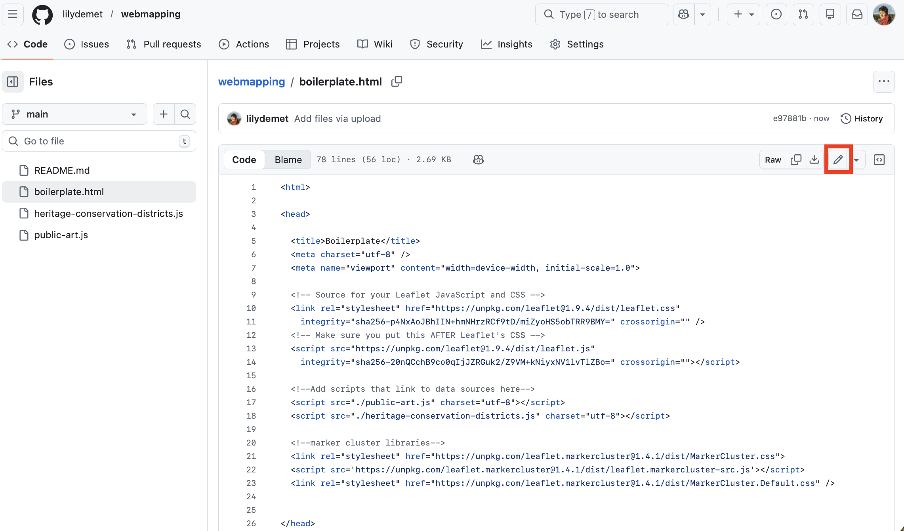

At the top, rename the file to `index.html`. BE SURE TO KEEP THE FILE EXTENSION `.html`!! 

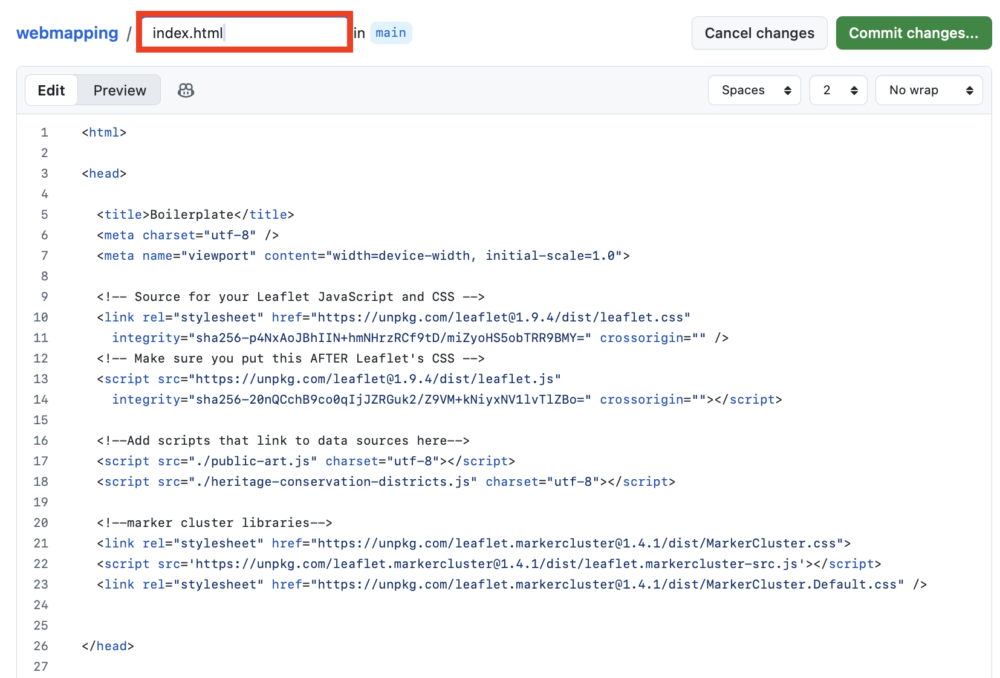

Then, **commit your changes** with the default message `Renamed boilerplate.html to index.html`. Return to the code view of your repository by clicking `webmapping`. 

### NOTE: If your map already has an index file. 
If your map is already contained in an index file, you'll have to *create a new, non-nested `index.html` file and embed your map inside it*. Create a new file, give it the name of `index.html`, and include the following code, adjusting for the appropriate filepath. Then commit. 


Copy/Paste
{: .label .label-purple }
```html
<!DOCTYPE HTML>
<head>
    <title>workshop webmap</title>
</head>

<body>
<iframe src="./qgis2webFOLDER-NAME/index.html" style="width:100%; height:700px; border:none;"></iframe>
</body>
</html>
``` 


<br>

## 5. Run Github Pages
{: .no_toc}
[Github Pages](https://pages.github.com/){:target="_blank"} allow you to create a little website from a code repository. The highest level `index.html` file will be the landing page for your website. This is why it was important to rename our boilerplate to `index.html`, and also why it is important to create a new, non-nested `index.html` when uploading an entire folder. 

To activate Github Pages, go to your repository's **Settings**. 


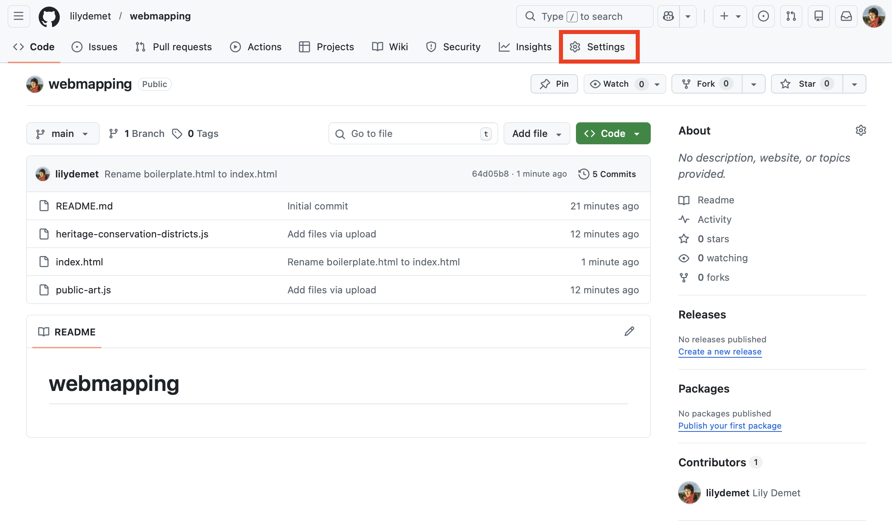


<br>

Then go to **Pages**:


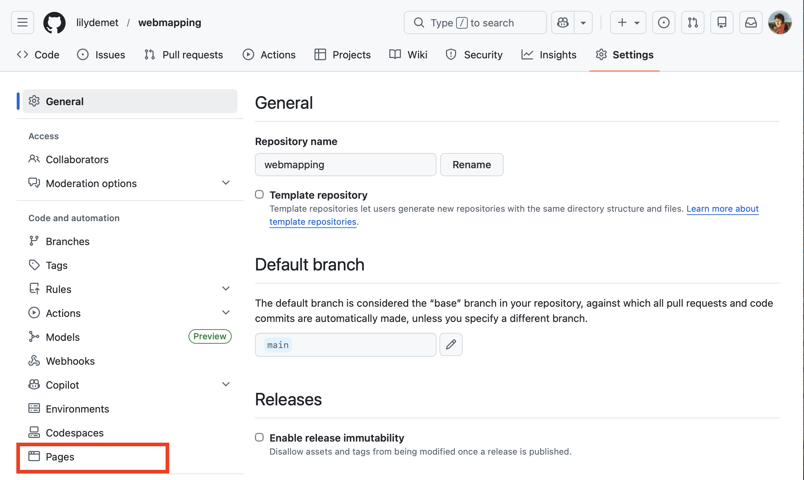

<br>

Change branch from None to **main** and **SAVE**.

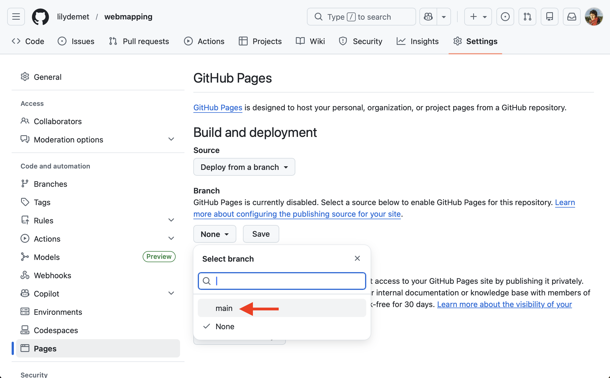

<br>


Once you hit save, give it a moment to build. After about 30 seconds (be patient), refresh your browser window. You should see a link now to your new website! Visit the site and explore your map once again. Now you can share it far and wide!

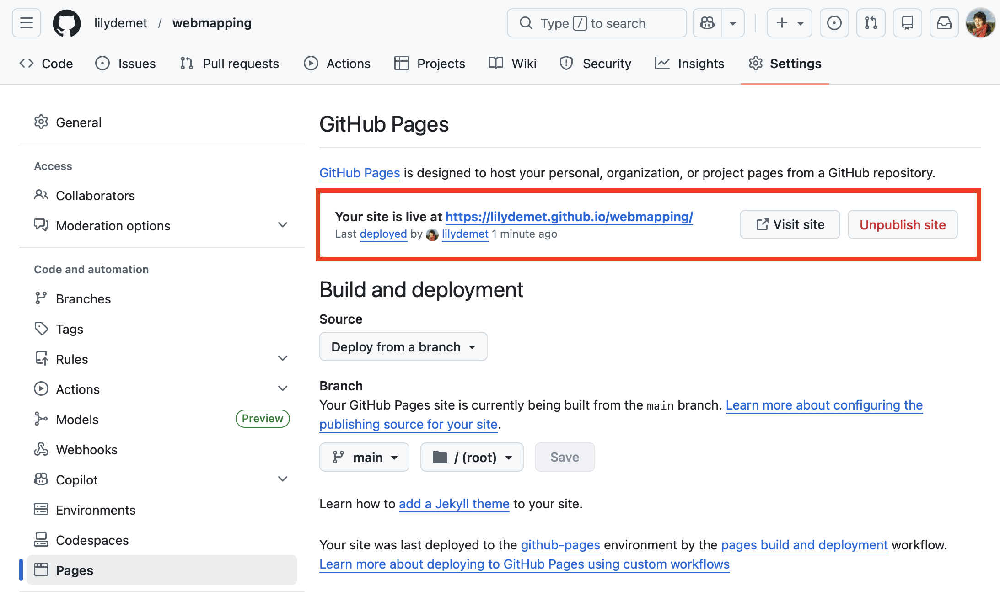


<br>

Click **visit site** to open the link in a new window. 

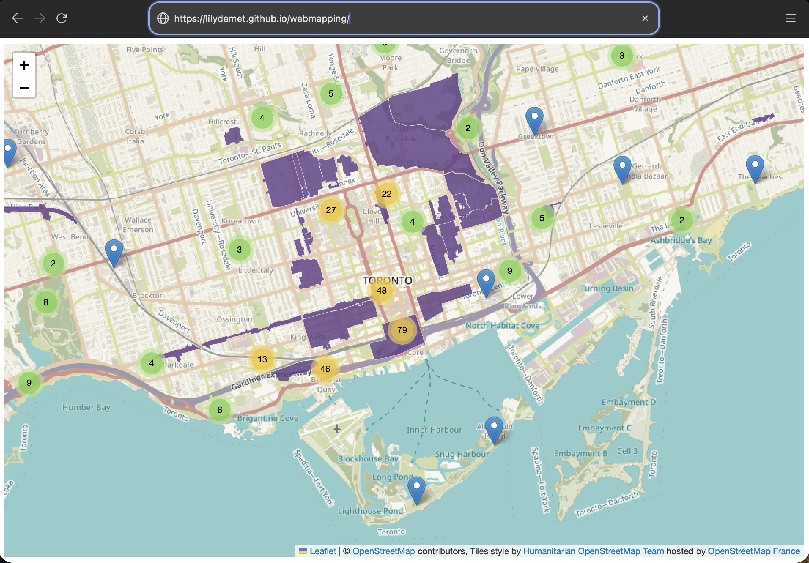

<br>

### One last step
Copy the link and return to your repo code. In the **About** section at the top right, add this link so that visitors to your repository can also access your website. 


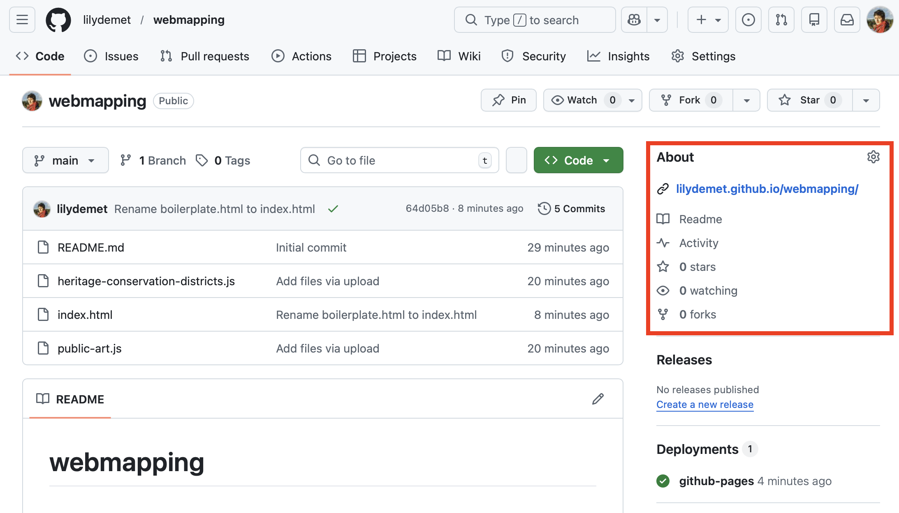


<br>

*Congratulations! Your webmap is now hosted and sharable!*