# Google MyMaps Demo
{: .no_toc}

  

    On this page:
  

  {: .text-delta }
 - TOC
{:toc}

-----

## Creating and naming a new map
1. Go to [Google MyMaps](https://www.google.com/maps/d/u/0/){:target="_blank"}. Create and/or login to your Google Account. 
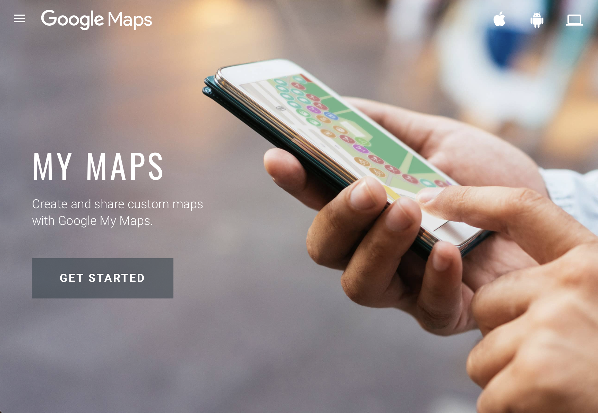
  

2. Click CREATE A NEW MAP  
 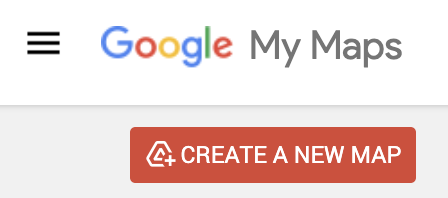
  

3. Once a new map has been created, your screen will look like this. 
 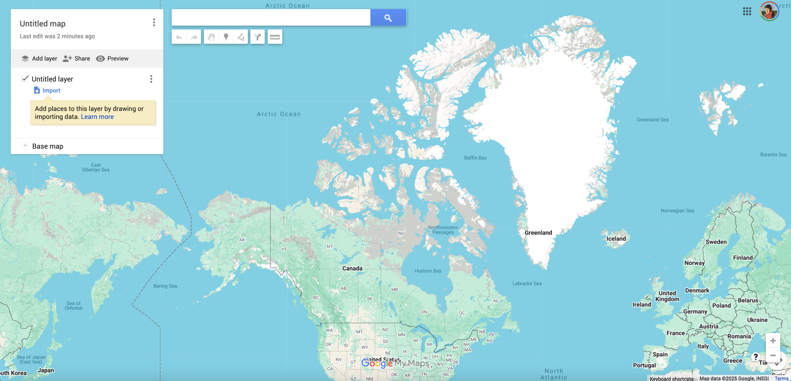
  

4. The interface is quite intuitive. In the top left-hand corner, there is a white box. The first thing you may notice is that your map is currently Untitled. Simply click where it currently says "Untitled map" and replace with your title. 
> - Let's **title** our map "Public Art in Toronto".
> - In the **Description**, add a data source statement such as: "Data curtesy of the City of Toronto Open Data portal, and licensed under the Open Government Licence – Toronto."

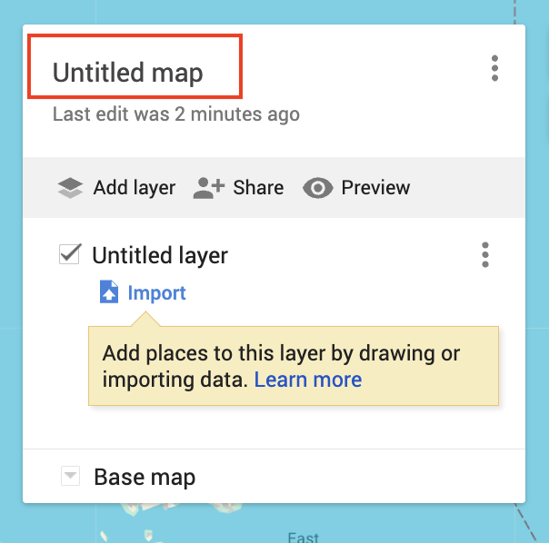
 

 

## Adding Data Layers

Beneath the title is a grey bar with options to "Add Layer", "Share", or "Preview".  

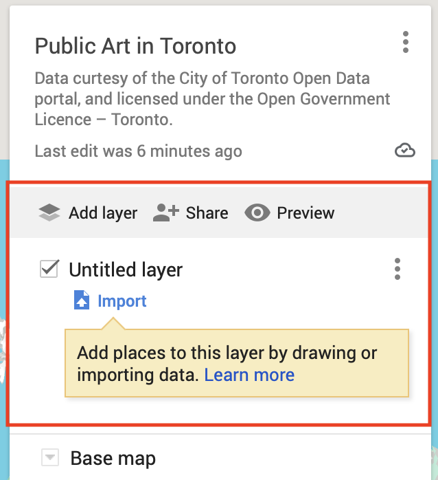
 

 - **Add Layer** will add additional layers to your map. Note: they will all be empty until you upload data to them. 
 - **Share** allows you to set the sharing options of your map, and send it to others. If you haven't given your map a name and description, you will be prompted to do so before sharing. 
 - **Preview** will give you a glimpse of how your map will look to others. 

Each layer of your map will initially be untitled. You can change the name any time. The check box indicates whether the layer is visible or invisible on the map upon initial load. You can edit or delete a layer by clicking the three dots beside it. Remember that *layers are containers for data*, and *each layer is empty until you upload data to it*.     

 

### Adding simple markers, shapes and lines
You can add stand-alone points and lines using the "Add marker" and "Draw a line" tools. Adding a marker will add a point to the current Untitled layer. You can always add a new layer, then drag markers between layers to stay organized. 

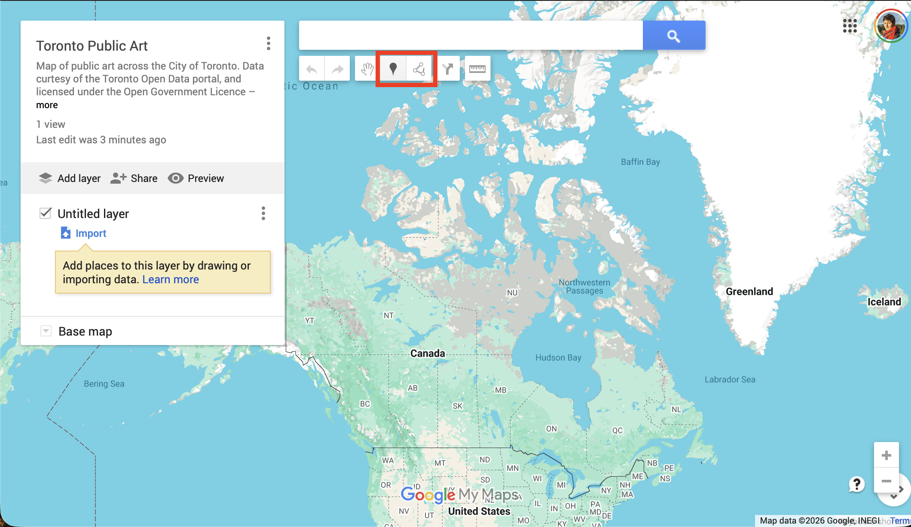
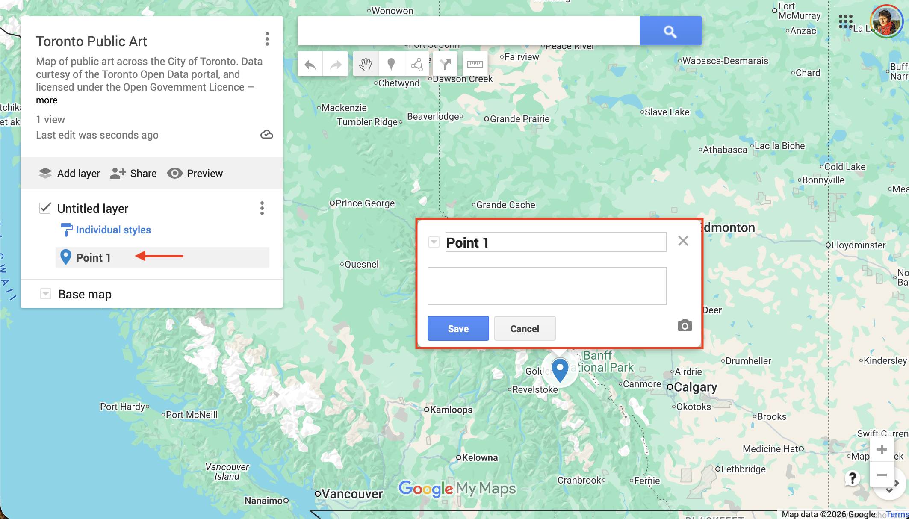

Alternatively, you can search for a place in the search bar, then choose to add it to your map. If you add it to your map as a marker, it will nest under your first Untitled layer. 

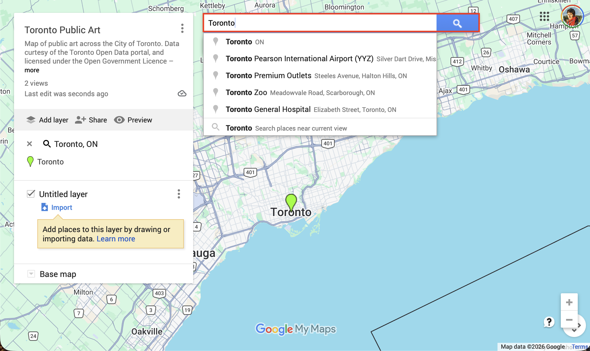
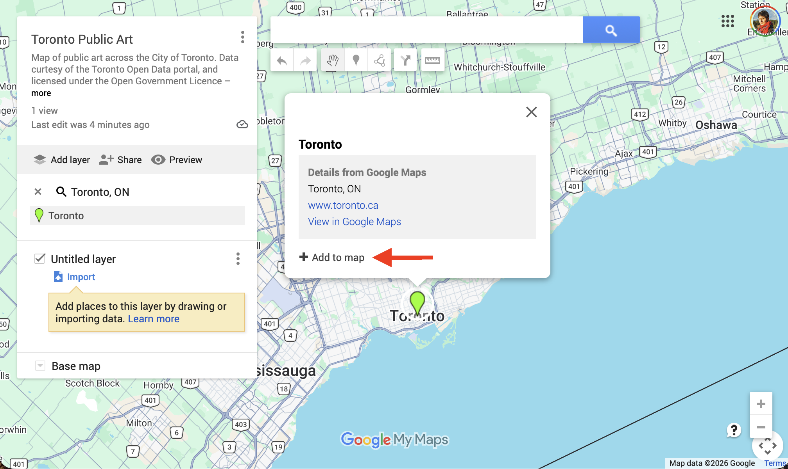

 

### Importing Data 

Now, let's upload a dataset to the Untitled layer. To do so, click on the **Import** button. When you hover over it, you'll notice it says you can only import data from a CSV file, spreadsheet, or KML. Import `public-art.csv` from the workshop data folder. It will be in the subfolder `webmapping-workshop/online-webmapping`.

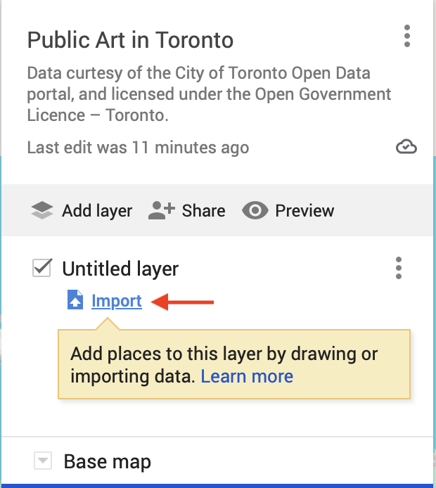

 

You will be prompted to "Choose columns to position your placemarks". This means Google is asking you which columns it should use to locate each feature. If you scroll down, you'll see that latitude and longitude have already been identified as the spatial component of your dataset. Click **Continue**. 

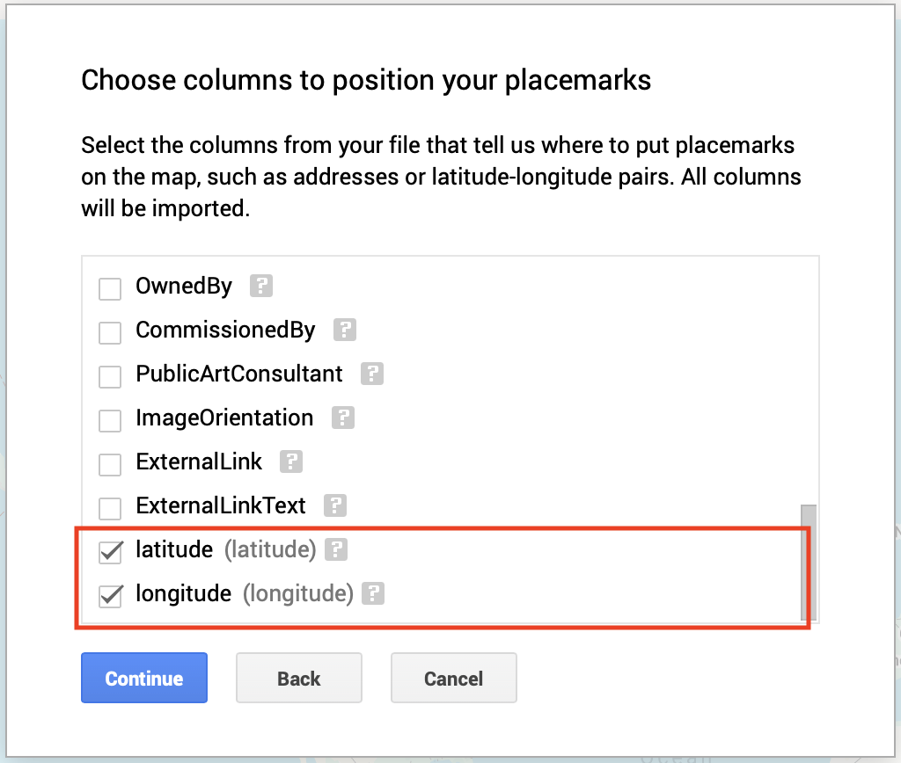

 

Next, you will be prompted to "Choose a column to title your markers". Here, you can choose "Title". Then, click **Finish**. You should now see `public-art.csv` added as a layer to your Google MyMap. 

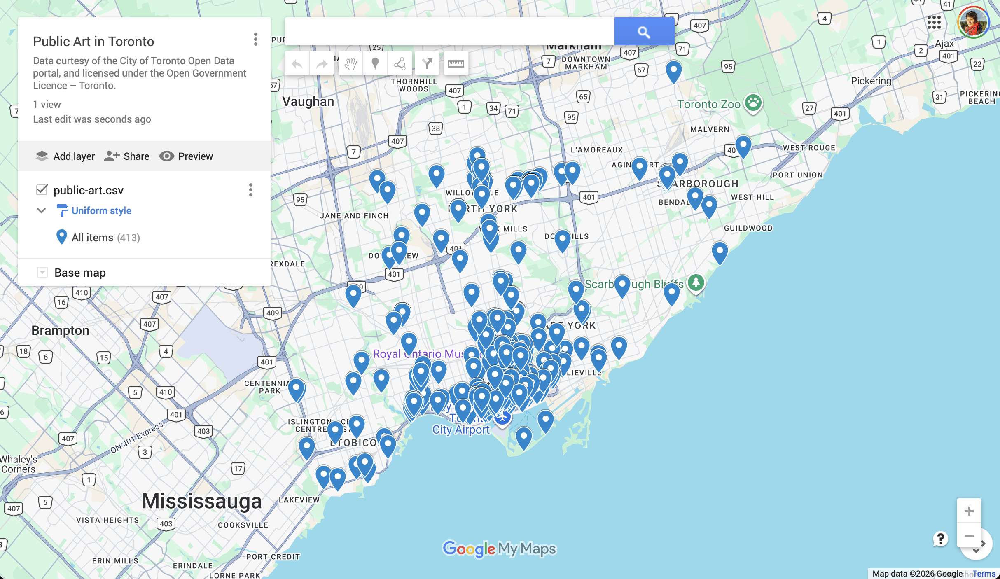

 

Click "Add layer"  and repeat the process to import and add `heritage-conservation-districts.kml` to your map. You likely won't need to prompt Google as to which columns contain spatial information as KML is a spatial data file already.

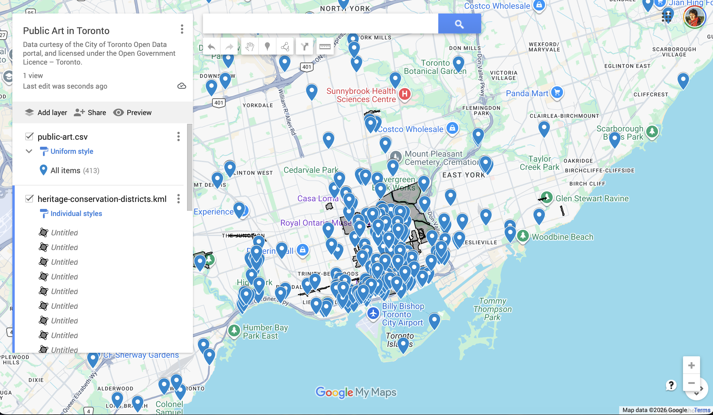

 

## Renaming Layers
To select a layer, simply click on the layer name. You can modify each layer by clicking the three dots to the right of the layer name.   

> * Check and un-check the box beside each layer to hide/show the layer. 

If you haven't made a name for each Untitled layer before importing data, layers will automatically take on the name of your uploaded file. To change the name of a layer, simply double-click the existing name. Alternatively, you can click the three dots to the right of the layer name, and choose "Rename this layer". 

> * Let's rename each layer to "Public Art" and "Heritage Conservation Areas" respectively. 

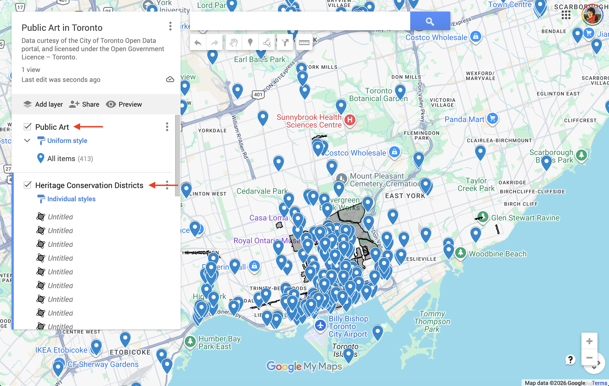

 

## Styling Layers 
Right now, the drop-pins representing Public Art are uniformly styled. This means that each icon is same color, size, shape, etc.  You can change the styling by grouping places/datapoints in the following ways:

- **Uniform style** What we have now. All points are styled the same. 
- **Sequence of numbers** Data points are each assigned a number.
- **Individual styles** Allows you to manually adjust the color and icon for each occurrence. After setting "Group places by" to "Individual styles", simply hover over any place and click the grey paint icon that appears to the right. 
- **Style by data column** Will assign a random color to occurrence of the column selected.  

We can change the styling of a layer by clicking the paint-roller icon. 
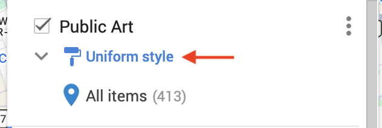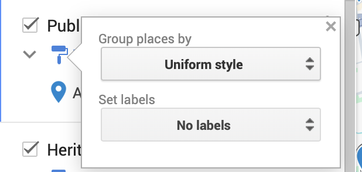

> * Change style to style by `Medium`.
> * Then, change style to style by `WARD_FULLNAME`. 

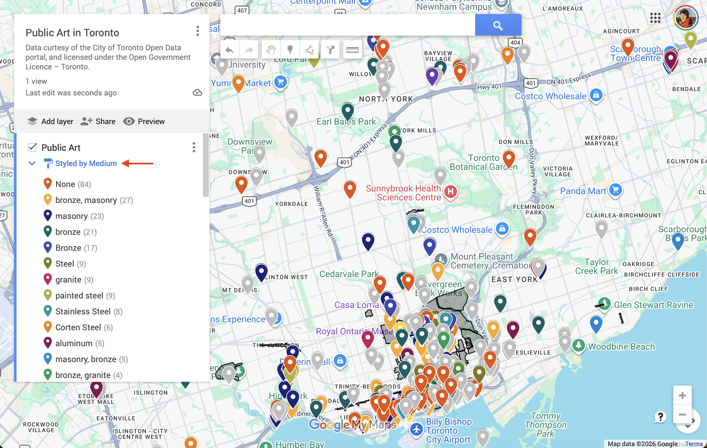
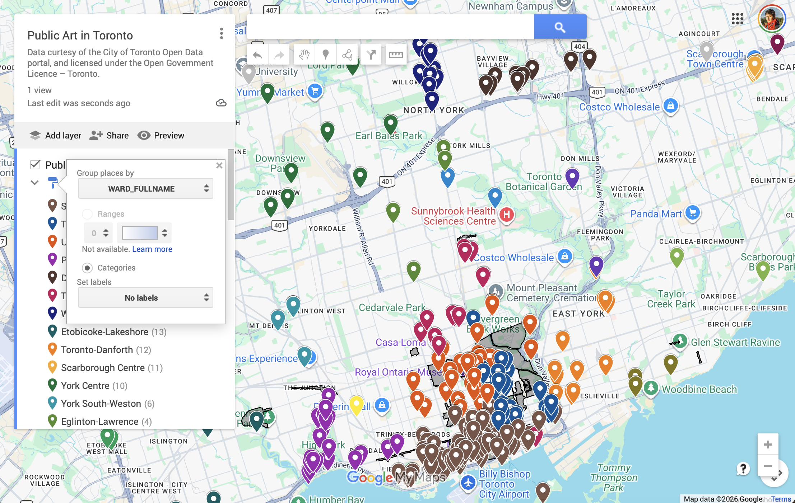

 

You can continue to edit the styling individual points/places even after they are styled by data column. For example, you can change both the **Icon** and the **Color**. However, be careful not to set the color of two categories the same unless they are related. 

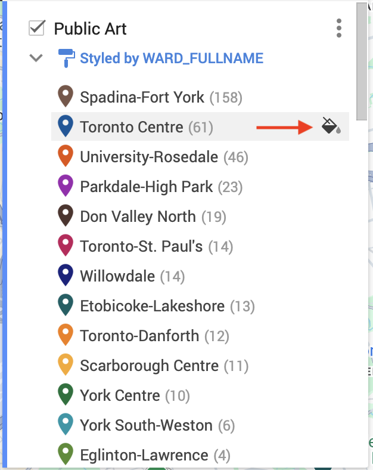
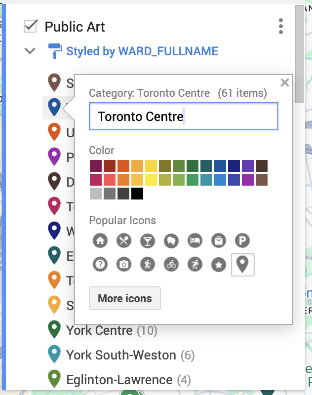

 

Now let's look at Heritage Conservation Districts. Uncheck public art so we can focus on the other layer. Currently, its set to individual styles. 

>  Change to uniform style, then update the color to something else.

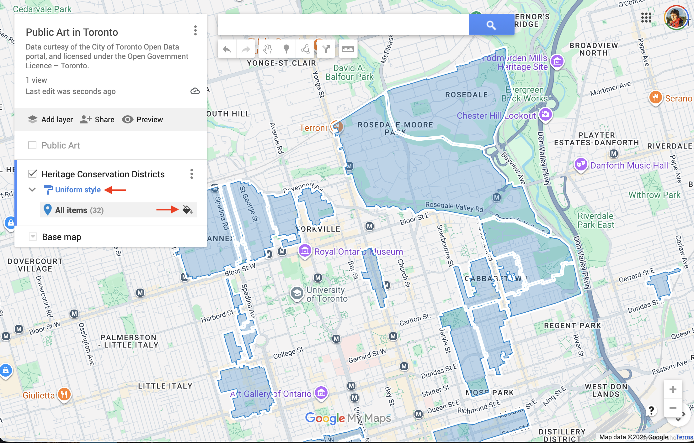

> Now turn the Public Art layer back on. 

 

## Layer interactivity + popups

If you click on a drop-pin for public art, lots comes up. Not all of this is important to the viewer. From Layer options, you can open the tabular data associated with this layer. 

While we can edit this table, adding and deleting columns, there is a better way to customize what fields/columns are included in the pop-up that doesn't include deleting/modifying our original dataset.

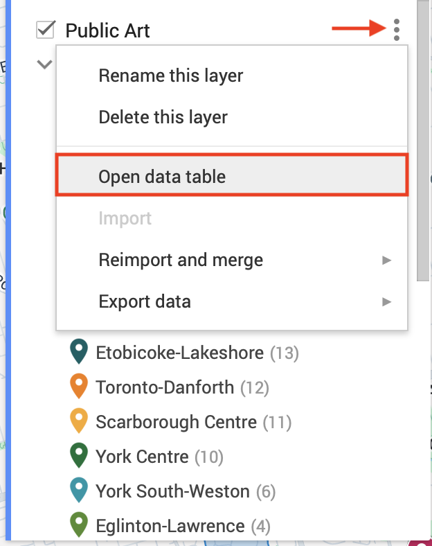 

> To edit what fields are visible in the popup, simply open a pop-up for any feature in a layer. Then, click **edit**. 

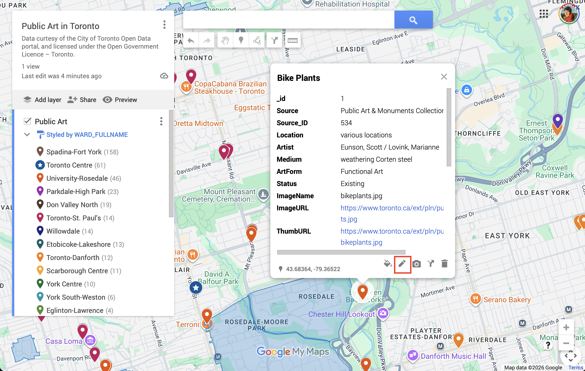

> Now, uncheck the fields you don't want. Then click **save**. 

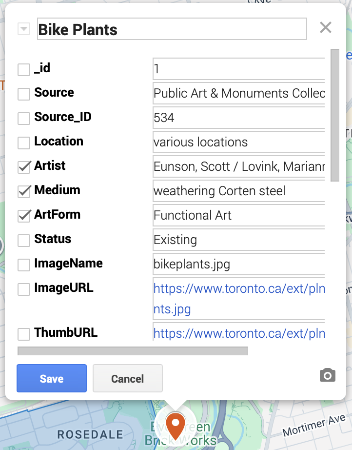

Note that if you want to change the label, like `WARD_FULLNAME` to simply "Ward", you'll have to duplicate the column `WARD_FULLNAME` in the edit table mode and then give it the desired name. then you can go back into editing popups, and select your new column. 

 

### Adding Images to Pop-ups
You can add images individually by clicking on the camera icon in an open popup. Unfortunately you have to add images one by one. in uMap however, you can add images for all features in a layer so long as the layer's tabular data has a column with a link to each feature's image. 

## Basemaps 
Finally, below your layers, there is an option to change your Basemap from a selection. 

## Saving and Sharing your Google MyMap
When you're ready to share your map, simply click the Share option at the top of your layers. You will be prompted to adjust the visibility settings, and given a shortened link to your new Google MyMap!

 

#### Resources for working with Google Maps
- Tutorial on [Google Maps and Google Earth](https://programminghistorian.org/en/lessons/googlemaps-googleearth){:target="_blank"} from the [Programming Historian](https://programminghistorian.org/en/lessons/?topic=mapping){:target="_blank"}
- Tutorial on [Point Map with Google My Maps](https://handsondataviz.org/mymaps.html){:target="_blank"} from [Hands-On Data Visualization](https://handsondataviz.org/){:target="_blank"} by Jack Dougherty & Ilya Ilyankou