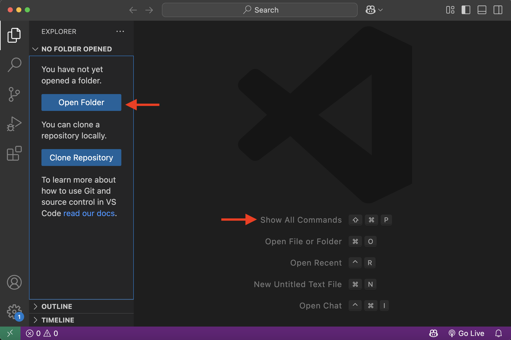
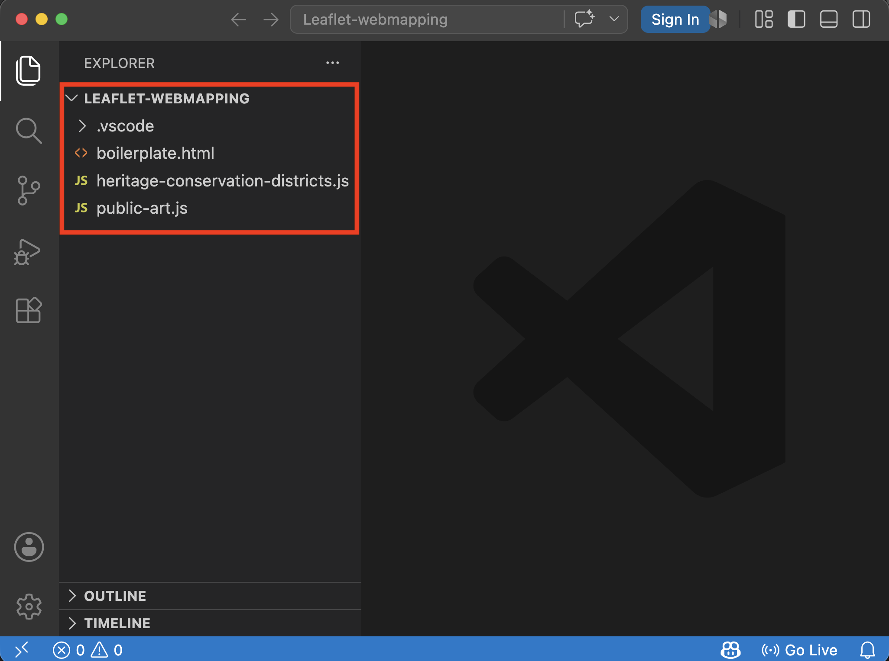
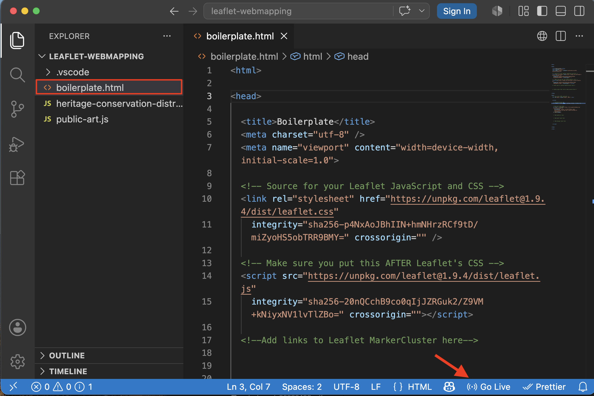

# Setting up a Developer Environment
In order to write the code that builds and renders your web maps you need a few things...
  

*1*{: .circle .circle-purple} First and foremost, you'll need access to internet connection and a computer with an internet browser installed. [Google Chrome](https://www.google.com/chrome/){:target="_blank"} or [Mozilla Firefox](https://www.mozilla.org){:target="_blank"} is recommended. (There have been some issues reported spinning up local websites made in QGIS from DuckDuck Go. This problem goes away, however, if the output folder is opened in VSCode first.) Whatever browser you choose, make sure you are using the most recent version.

 

*2*{: .circle .circle-purple} To make your life easier while viewing or editing code, it's good to use a [source code editor](https://en.wikipedia.org/wiki/Source_code_editor){:target="_blank"}. We recommend [Visual Studio Code](https://code.visualstudio.com/download){:target="_blank"}. Please take a moment to install it now if you have not already.
<!-- , but other editors like [Notepad++](https://notepad-plus-plus.org/) or [Sublime Text](https://www.sublimetext.com/3) will work similarly. -->

## Open Data in Code Editor
*1*{: .circle .circle-purple} First open the Visual Studio Code (VS Code) application. To open the folder `Day4` with VS Code, select Open... from the Welcome Page and navigate to your data folder is stored on your computer. Select it (but don't click *into* it) and hit Open. You can also click the Open Folder button in the Explorer pane, or press `command + O`. **If you are having any trouble, ensure your data folder is unzipped.**

*2*{: .circle .circle-purple} Once opened, you should see multiple files in the Explorer panel of your code editor. 

`heritage-conservation-districts.js` and `public-art.js` are data files, while `boilerplate.html` is the map boilerplate we will tinker with and customize. 
    
   

*3*{: .circle .circle-purple} Now, double click `boilerplate.html`  to open it.

If you installed the Live Server extension to Visual Studio Code, in the blue ribbon at the bottom of your code editor there should be an option to “Go Live.” Click “Go Live” to launch a local server and watch your map automatically update in a web browser. 

Depending on your computer’s operating system, you may need to hit Ctrl + S to save your document edits before Live Server will update to reflect your changes. Live Server alleviates the need to constantly refresh your browser each time you make a change.
{: .note}

Because we will be working back and forth between the browser page and the code editor, it’s helpful to arrange your computer screen(s) in a way where you can either see both windows at once or are able to toggle between the two. This way, every time you modify the HTML code you can see the changes in your browser. You’ll also want to have workshop website accessible.