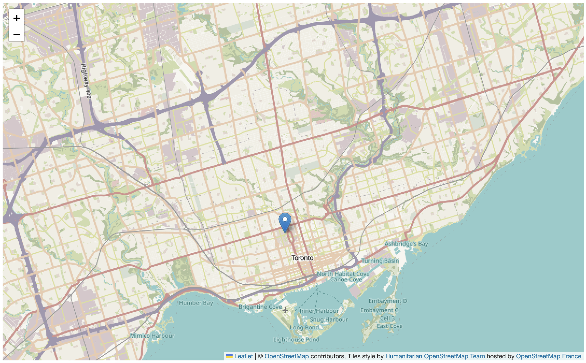
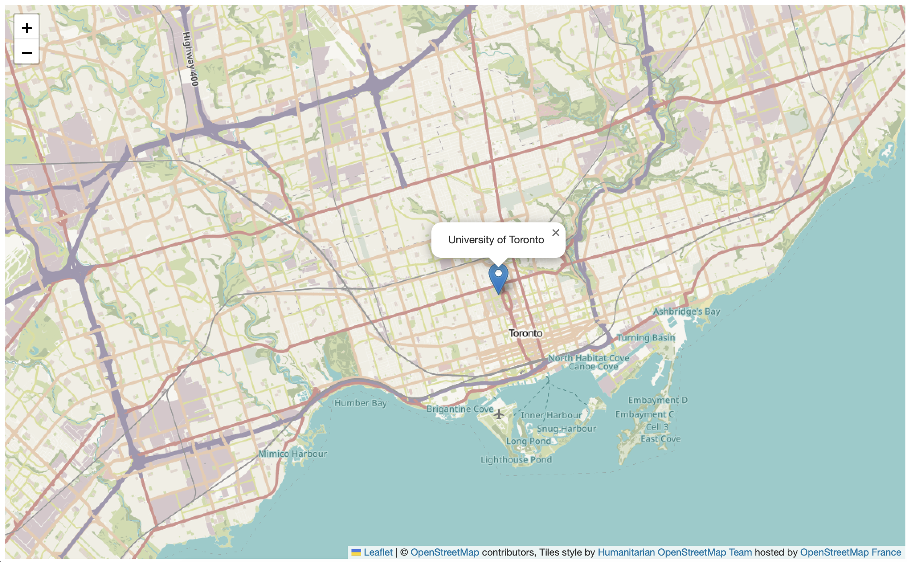

# Map Data
Another component of a web map is the data added to it. Your data sits on top of your basemap. While the basemap, or map tiles, are a necessary part of your map, they're really there to provide reference for your data. We call the overlaid data your "data layer", "map content", or sometimes "map features". Most of the time, your data is vector data so you can click and interact with it, but you can also add raster data.    

If you’re a GIS user, you have likely encountered a shapefile before. Shapefiles are the industry standard file type for geographic vector data. If you’ve ever tried to share a shapefile in the web, you’ve probably had some problems, or needed to transform your file into something else. Shapefiles are meant to be used in GIS and other software and weren’t designed to be displayed in the web. [GeoJSON](https://geojson.org/) on the other hand, is a geospatial file type meant for the web. GeoJSON is “easy for humans to read, and easy for machines to read”, meaning it's a lightweight, simplified format your average web browser can use. And, they’re also fairly easy to understand if you want to view and edit them in a code editor. Here’s the geoJSON for a point over the University of:

```json
 {
      "type": "Feature",
      "properties": {},
      "geometry": {
        "coordinates": [
          -79.39567167921362,
          43.66522362223668
        ],
        "type": "Point"
      }
    }
```

<br>
In contrast, a shapefile stores data in binary (0s and 1s, not text), so you wouldn't be able to read the file with human eyes. For these reasons, we're using geoJSON files for this workshop.
    
Earlier, we mentioned how Google Maps and Leaflet use the same coordinate reference system (CRS). All data added to a Leaflet map **must be in WGS84**. So, either download it in that format, check what CRS your coordinate points were logged in, or reproject your layers if necessary in a GIS such as QGIS. If you add data and it doesn't show up, it could be a projection issue.
{: .note}    

----

## Adding a single marker
First things first, let's add a single marker to our map. We will add a marker for the University of Toronto. 

To Do
{: .label .label-green }
Add a Leaflet marker by copy/pasting the following code into the <code>script</code> element of your map boilerplate HTML document, just under the code for map tiles. 

Copy/paste
{: .label .label-purple }
```js
var university = L.marker([43.66522362223668, -79.39567167921362]).addTo(mymap);
```    
You should see something like this:




If you'd like, you can zoom your map in a bit - maybe up to 12. Notice also. x and y reversed now. 


You can add popup information by adusting the code slightly: 
Copy/paste
{: .label .label-purple }
```js
var university = L.marker([43.66522362223668, -79.39567167921362]).addTo(mymap).bindPopup("University of Toronto");
```   



<!-- 
### Optional Activity 

One other great thing about geoJSON, is that because they are open-source and simple to understand, there are several tools that allow you to create and edit them in the web, like [geojson.io](http://geojson.io).


To Do
{: .label .label-green }
1. Delete existing geoJSON text on the </>JSON panel of [geojson.io](http://geojson.io).
2. Copy the GeoJSON text above and replace what you just deleted on geojson.io.
3. Click the edit layer button to view the feature properties.
4. You can add or edit the feature's properties there, or directly edit the GeoJSON file's attributes in the Table panel. 


If you look to the bottom left corner of this map you'll see its powered by Mapbox. [Mapbox](https://www.mapbox.com/) is an elaboration on Leaflet's original code library, and now includes products such as toolkits for mobile app development, navigation, web maps, and data management. Mapbox’s service model is based on a paid subscription, but they offer a free service tier for those interested in using Mapbox products for learning. Check out the Research Commons' workshop [An Introduction to Mapbox](https://ubc-library-rc.github.io/intro-mapbox/) if you are interested in learning more.
 -->

