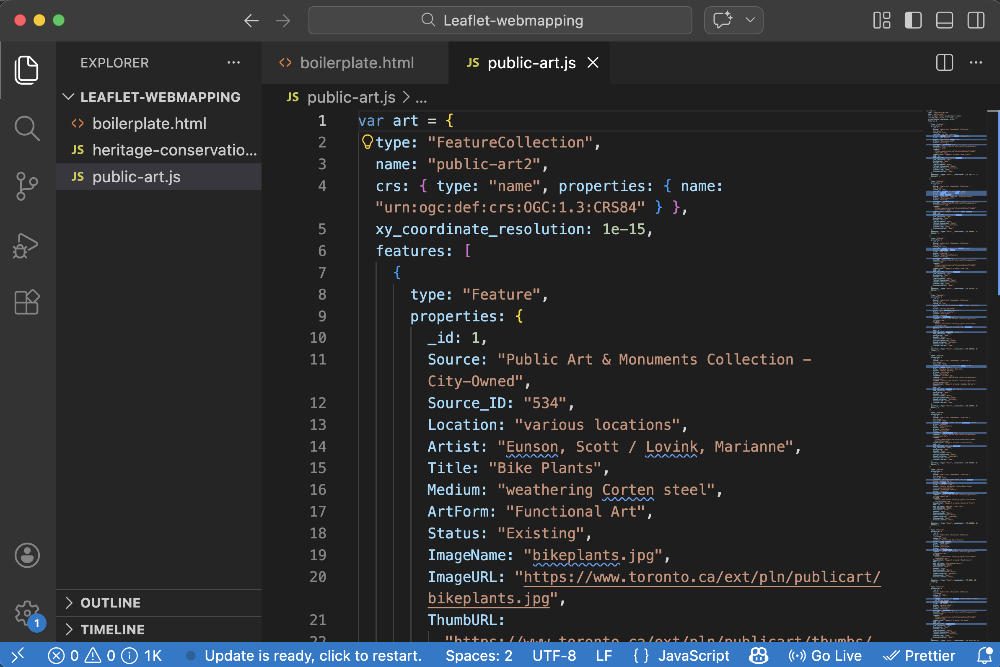
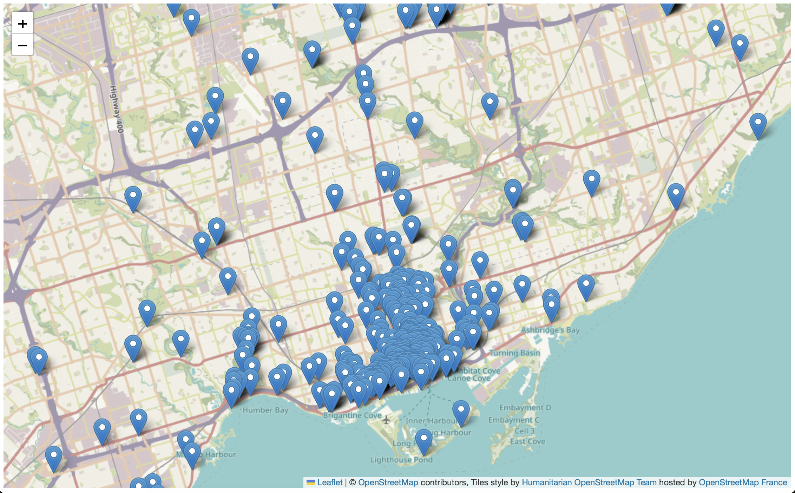
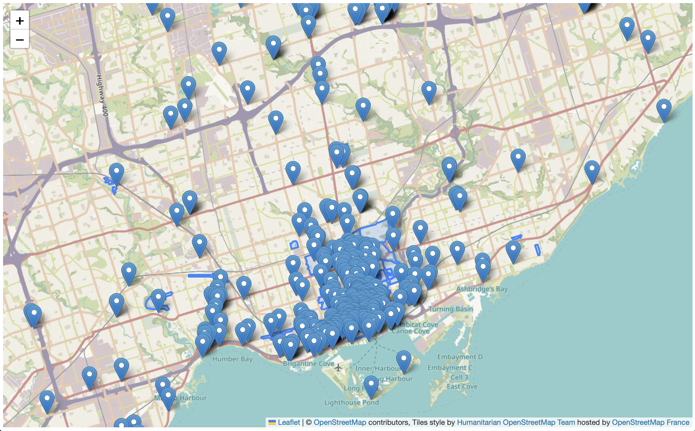
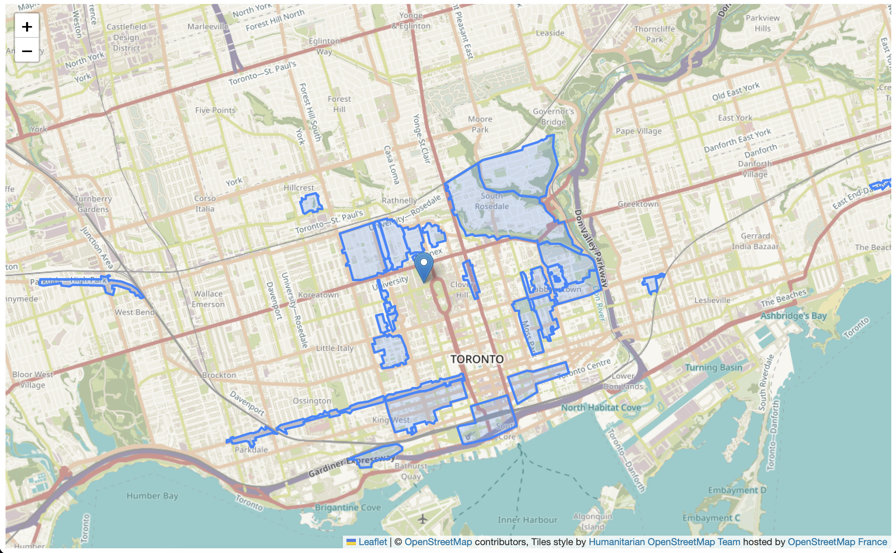

# Adding Data Layers
{: .no_toc}
It's now time to add some map features! In this section, we will add a point data layer and a polygon layer to the boilerplate web map. 


<details open markdown="block">
  <summary>
    On this page:
  </summary>
  {: .text-delta }
 - TOC
{:toc}
</details>
----


## Adding a point layer 
Now let's add a point layer representing Public Art. In VS Code, open the file `public-art.js`. If needed, right-click anywhere in the document and click "Format Document". You can also click `Option + z` to justify the document so all the code fits within the margins of your window. 

 

 -  **Note:** While the data was downloaded from Toronto's Open Data portal in `.geojson` format, you'll notice the filetype is `.js`. This is because the entire geoJSON dataset was "wrapped as a JavaScript variable". This allows us to reference the dataset as the variable `art` in our web map HTML document. To "wrap a geoJSON dataset as a variable", all that was done was to add `var art = ` was added to the beginning of the dataset, and then the dataset was "Saved as" a JavaScript file type. 

<br>


Though data layers are more complex than single markers, we add them in a similar manner: by creating a new variable holding the values for the geoJSON feature(s).    

To add a point layer of Public Art to your web map of Toronto, copy and paste the following line of code below your marker(s), where the comment says ` // Add point layer here`.

Copy/paste
{: .label .label-purple}
```js
L.geoJson(art).addTo(mymap);
```    

At first, nothing will show up. This is because we need to do one more thing. We need to **link all datasets referenced in the head element** of the web map. Copy and paste the following code at the very end of your web map's `<head>` element underneath the comment `  <!--Add scripts that link to data sources here-->`. 

Copy/paste
{: .label .label-purple}
```html
<script src="./public-art.js" charset="utf-8"></script>
```
<br>

Your web map should now look something like this:   

 

<br>

Notice the data source we added in the `<head>` element locates the dataset in `./public-art.js`. The `./` preceding the filename denotes a relative path. A [relative path](https://www.w3schools.com/html/html_filepaths.asp) is a path to a file that is in the same folder as your HTML document. If your data were stored in downloads, for instance, the source link would look like `src="./downloads/public-art.js"`. If your data were stored on a server or hosted by an external web source, as are the CSS and Javascript, the source link would direct the web browser reading and rendering your map's HTML document to that address. 
{: .note}

<br>

----


## Adding a polygon layer
Adding a polygon layer is similar to adding a point layer. First, check the data file `heritage-conservation-districts.js` and note that the geoJSON data has been wrapped as a JavaScript variable called `heritage`. 

First, add a link to the data source in your web map's `<head>` element:
    
Copy/paste
{: .label .label-purple}
```html
<script src="./heritage-conservation-districts.js" charset="utf-8"></script>
```
<br>
Then, add `parks` as a data layer in the `<script>` element below your marker and point layer:

Copy/paste
{: .label .label-purple}
```js
L.geoJson(heritage).addTo(mymap);
```
<br>  

If all went well, your map should now look like this: 
 
<br>

If you find it busy, you can always remove the `L.geoJson(heritage).addTo(mymap);` line that loads heritage districts, or "comment it out" by hitting `command + /`. 
<br>

 


## Styling Layers
Perhaps you want to change the way parks polygons are styled. For example, we could change them to be a solid color such as green. This way, they'd stand out against the basemap. 

to change the styling of a polygon data layer, we will 1) write a *function* that styles a specific layer, in this case `parks`, and 2) add our new style as an option to that data layer. A *function* in programming is a block of code that does some specific task, like a mini program. In your web map HTML boilerplate document, replace the line of code for parks with the following:

```js
    L.geoJson(heritage, {style: style}).addTo(mymap);

    function style(feature, heritage) {
      return {
        fillColor: '#5E3A85',
        color: '#EBE1F0',
        weight: .5,
        fillOpacity: 0.8
      };
    }
```

There, we have created a style function that looks at every feature in the `heritage` layer and gives it a `fillColor` of `#5E3A85`, which is the [HEX code for purple](https://www.google.com/search?q=hex+color+picker&oq=hex+color+picker&aqs=chrome..69i57j35i39j0i67i131i433j0i67i433j0i433i512j0i67j0i512j0i131i433i512j0i512l2.1699j0j7&sourceid=chrome&ie=UTF-8). `color` dictates the color of each feature's outline, and `weight` is the thickness of those outlines. `fillOpacity` is the transparency of the shading, where 0 is completely transparent and 1 is completely solid. Take a moment to play around with the color of the heritage districts.
<br>

 