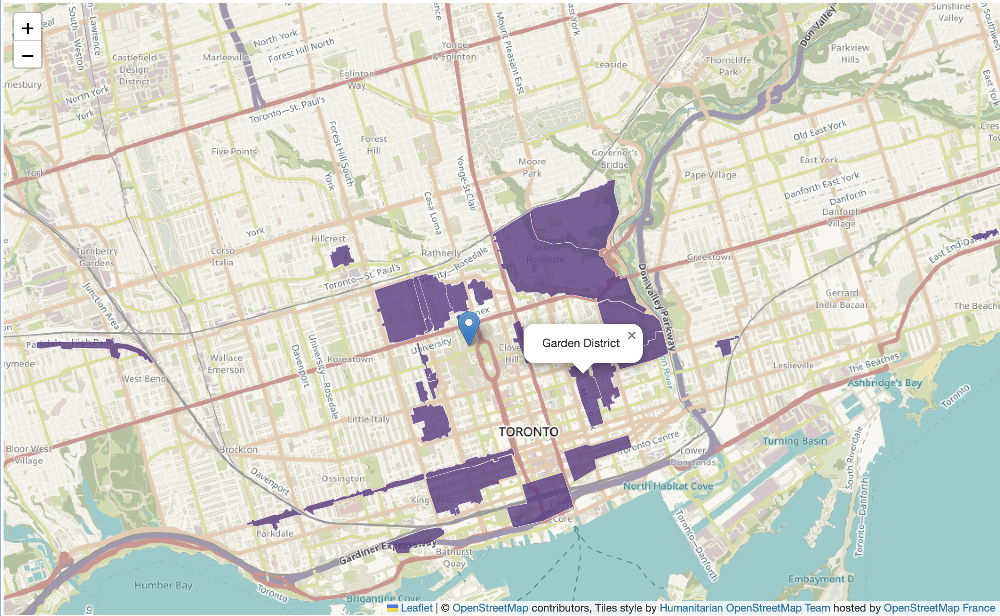
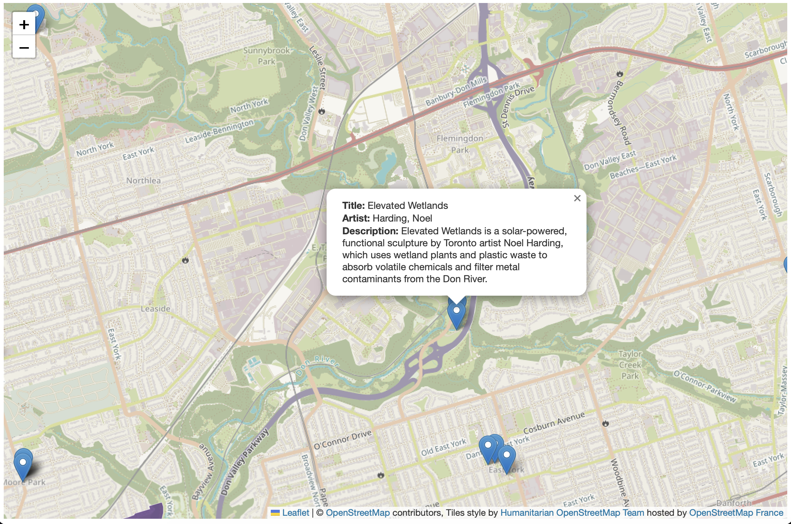
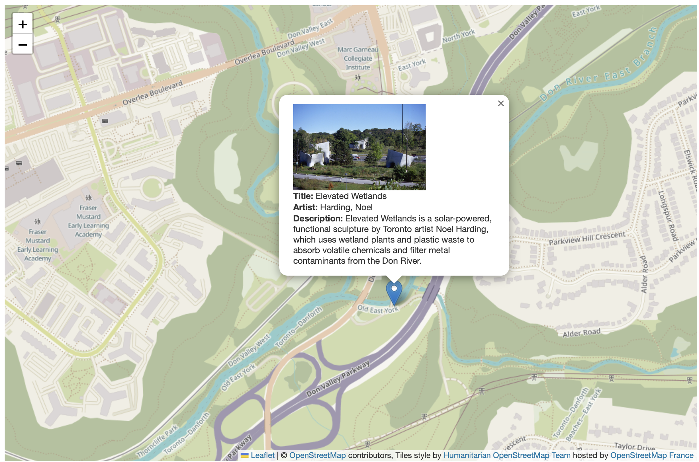

# Configuring Popups
{: .no_toc}

Both the Public Art and Heritage Conservation Districts datasets contain attribute values for each feature. We got a glimpse of these when looking at the datasets in VS Code. Currently, if we click on the features in our web map, we cannot view this information because we haven't yet configured our map to load pop-ups for each layer. To add pop-ups with specified attribute information, we'll need to add more functions. 

Below, you'll be shown how to add pop-ups to the point layer, the polygon layer, as well as configure these pop-ups. 


<details open markdown="block">
  <summary>
    On this page:
  </summary>
  {: .text-delta }
 - TOC
{:toc}
</details>
----

<!-- Let's begin by adding the Titles of Public Art as pop-ups to our web map. We know from looking at the data layer in VSCode that the value for the title of each public artwork is contained in the attribute titled `Title`. The function we'll use to add pop-ups to each feature is called `onEachFeature`. This function is *case sensitive*, so be sure to xyz.  -->

## Naming Heritage Districts
Let's begin by adding the names of the Heritage Conservation Districts as pop-ups to our web map. We know from looking at the data layer in VSCode that the value for the name of each District is contained in the attribute titled `HCD_NAME`. The function we'll use to add pop-ups to each feature is called `onEachFeature`. This function is *case sensitive*, so be sure to xyz. 

Then, just like when *styling* the Heritage Districts, we have to add an option `{onEachFeature}` to the code that loads the data layer that references this new function. In your web map's HTML document, replace the code that adds community gardens as a point layer with the following:

Copy/Paste
{: .label .label-purple }

```js
 L.geoJson(heritage, {onEachFeature, style: style}).addTo(mymap);

      function onEachFeature(feature, heritage) {
          { if (feature.properties && feature.properties.HCD_NAME) { heritage.bindPopup(feature.properties.HCD_NAME); } }
        }

     function style(feature, heritage) {
      return {
        fillColor: '#5E3A85',
        color: '#EBE1F0',
        weight: .5,
        fillOpacity: 0.8
      };
    }
```

<br>

If all went well, the name of Heritage Conservation District should popup when you click. 

 


## Describing Public Art
For the Public Art layer, we might want to include more information in a popup, such as the Title, Artist, Description.

 

turn public art layer back on - uncomment out - same way. 

```js
   L.geoJson(art, {onEachFeature: function(feature, layer){
            layer.bindPopup(
                feature.properties.Title + "<br>" +
                feature.properties.Artist + "<br>" +
                feature.properties.Description
                );
        }
    }).addTo(mymap);
```

With leaflet, you can mix html into a popup so as to style labels for text. describe whats going on above. could add as many as we want. 

might be good to have "Title:..." and "Artist:..." and "Description:..." and so on. Add together html css styling between "" and the with + connect with js. 

```js
   L.geoJson(art, {onEachFeature: function(feature, layer){
            layer.bindPopup(
                "<b>Title: </b>" + feature.properties.Title + 
                "<br><b>Artist: </b>" + feature.properties.Artist + 
                "<br><b>Description: </b>" + feature.properties.Description
                );
        }
    }).addTo(mymap);
```




## Images 
Finally, as we see in the Public Art layer there is even a link to an image. This would be great to include in our popup! 


```js
 L.geoJson(art, {onEachFeature: function(feature, layer){
            layer.bindPopup(
                "<br><b>Title: </b>" + feature.properties.Title + 
                "<br><b>Artist: </b>" + feature.properties.Artist + 
                "<br><b>Description: </b>" + feature.properties.Description
                );
        }
    }).addTo(mymap);
```

