# uMap Demo
{: .no_toc}

<details open markdown="block">
  <summary>
    On this page:
  </summary>
  {: .text-delta }
 - TOC
{:toc}
</details>

-----

## Creating a new map

1. Go to [umap.openstreetmap.fr/en/](https://umap.openstreetmap.fr/en/) and **Log in/Sign in**. This ensures any map/work you create will be saved so you can return to it later.<br>
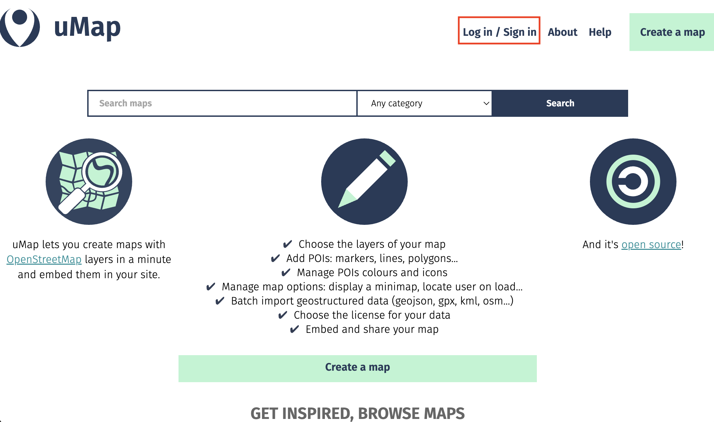
<br><br>
2. Click **Create a map**. <br>
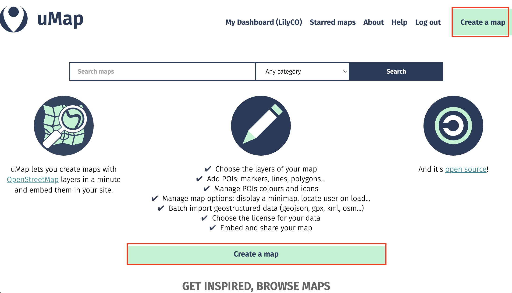
<br><br>

### The Interface 
{: .no_toc}

Here is your working interface. Along the top is a menu bar. You'll notice the visibility is set to private. This will remain so until you go to share it, when you'll be prompted to update visibility settings so anyone can see it. You can give your map a name, save your draft as you're working, and preview it as soon as you make any changes. 
<br><br>
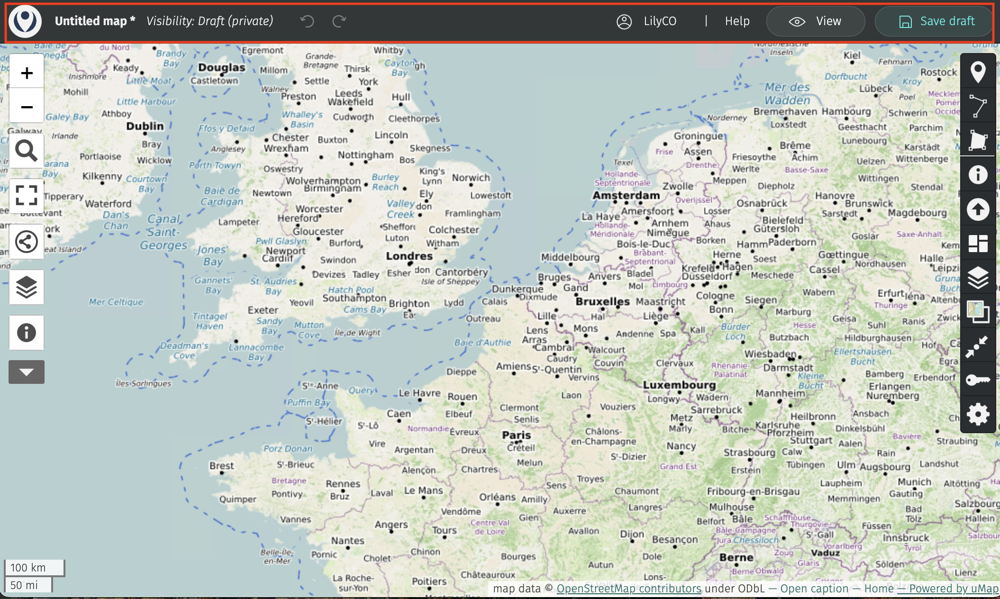
<br><br>

> Click on "Untitled map" and replace with your title. Let's **title** our map "Public Art and Heritage Districts in Toronto". In the **description**, add a data source statement such as: "Data curtesy of the City of Toronto Open Data portal, and licensed under the Open Government Licence – Toronto." You could also add this in the **Credits** section. 

Then, **save your draft**! uMap does not autosave. Once saved, the little asterisk beside your map title will disappear. 

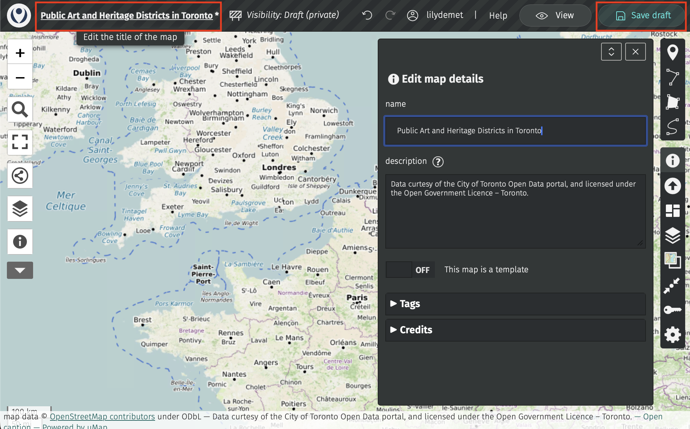


Along the two sides of your screen you'll notice two vertical toolbars. **The toolbar on the left allows you to zoom in and out, to share and download the map, and to browse any data layers you add.** If you click the drop down arrow even more options will appear.

Use the **Search location** tool to search for Toronto. This will center your basemap map over Toronto. 
<br><br>
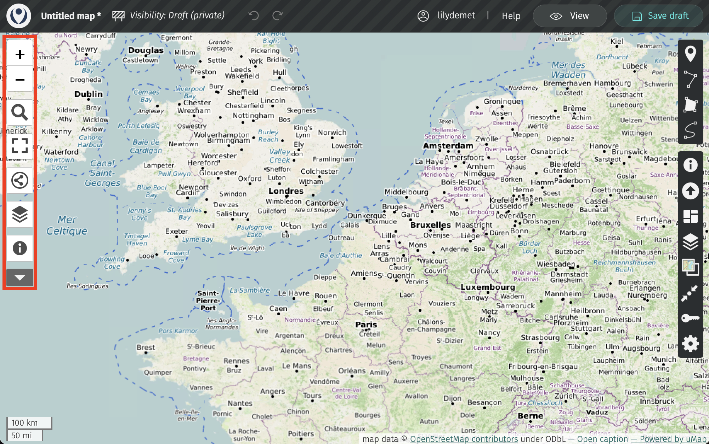
<br>
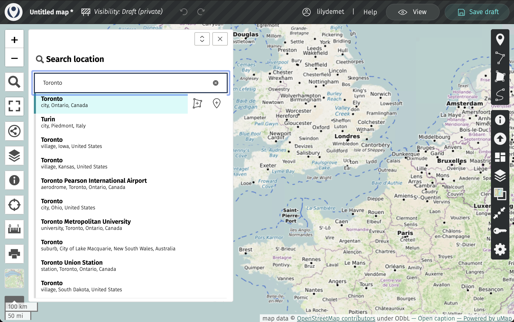
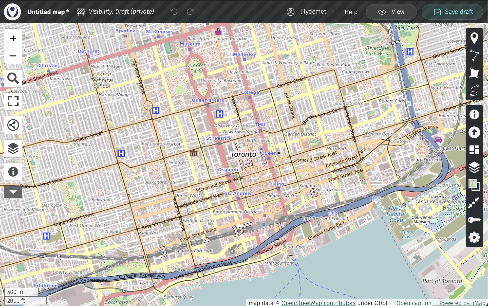
<br><br>

<br>

**The toolbar on the right allows you to add and manipulate data.** The first three tools allow you to add markers, lines, and polygons directly to your map. If you just want a few shapes or drop-pins, no need to create a data layer elsewhere first. However, if you *have* datasets you want to add to the map, you can upload them.


## Adding Data Layers

Use the **Importa data** tool  to add datasets to your map. 

> One layer at a time, add both `public-art.geojson` and `heritage-conservation-districts.geojson` from the folder `webmapping-workshop/Online-webmapping/`. 

Notice that the drop-down menu of "Choose the format" indicates what formats are acceptable for upload. Many more than in Google MyMaps! So, while geoJSON layers were provided for you, you could re-use the CSV and KML files from Google MyMaps if you'd like. 

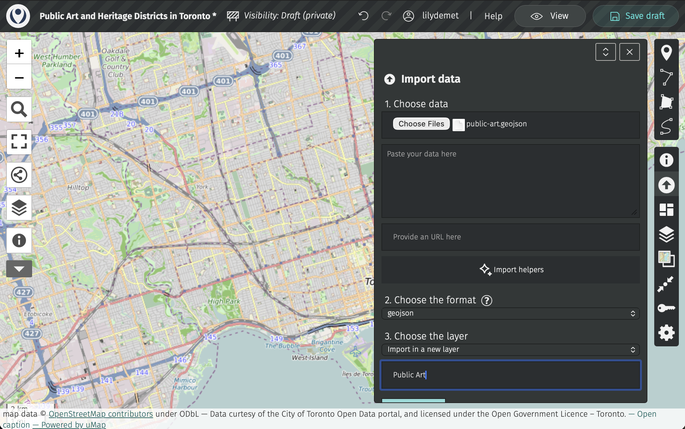
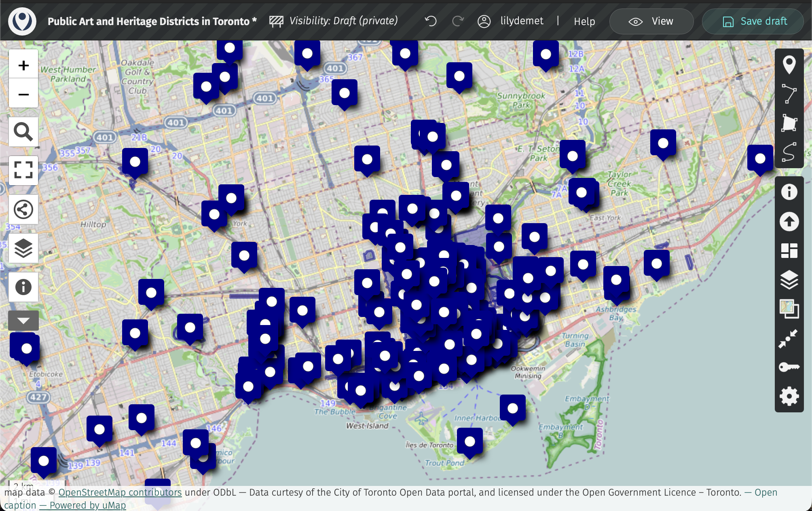


Once uploaded, **save your draft** again. 
<br><br>

## Manage Layers

You can manage your layers, including toggling their visibility, updating their symbology, and configuring their pop-ups from the **Manage layers** tool in the right-hand toolbar. 
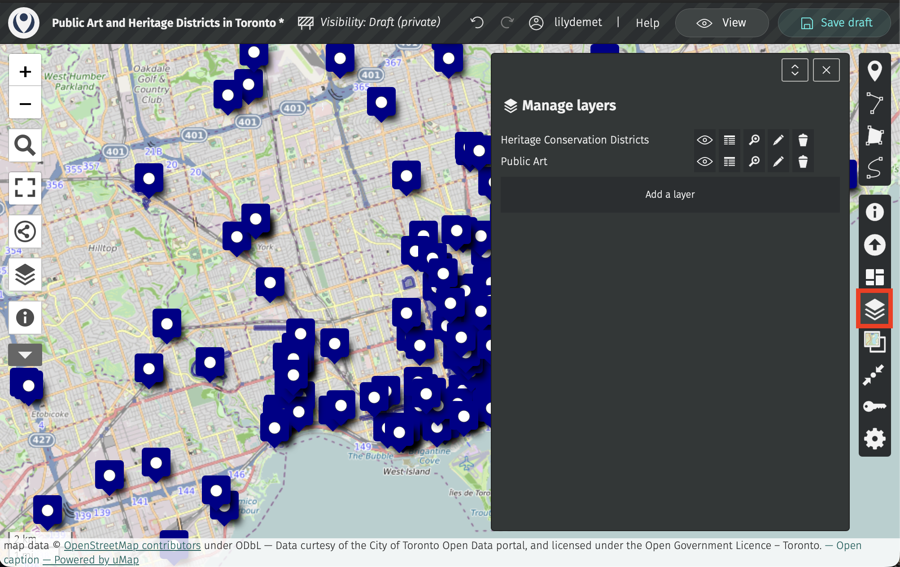

The eyeball icon - toggle visiblity. The table icon - view tabular data associated with each layer. The magnifying glass icon - zoom to layer extent. Pencil icon - edit layer, and finally, the trashcan - remove layer. Also able to add a new layer below. 

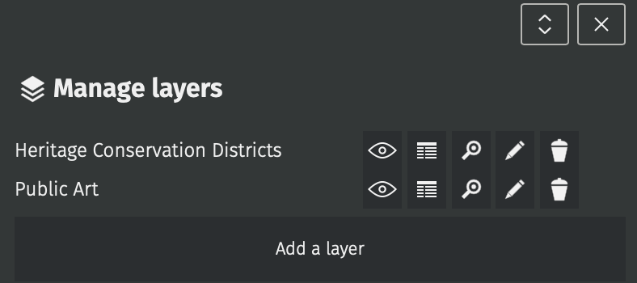

### Layer Properties 

Click the pencil icon to edit a layer. This will take you to the **Layer Properties**, where you can give your layer a title if you uploaded it without one. 

Open the **Layer Properties** of the Public Art layer. 


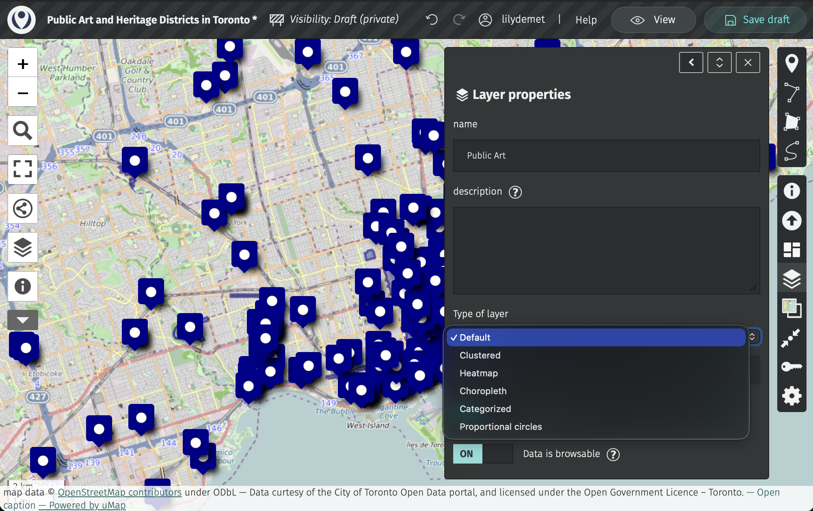

Change from default point layer to clustered or heatmap. Proportional symbol isn't a good option as none of the attributes of public art - value. ward number - not relevent value for sizing symbols. choropleth - would need polygon layer. 

Either keep default, or Let's change to clustered. You can then adjust the clustering radius. 

Collapse cluster settings. 


Now, expand **Shape properties**. Here, you can customize the icon color *and* shape.

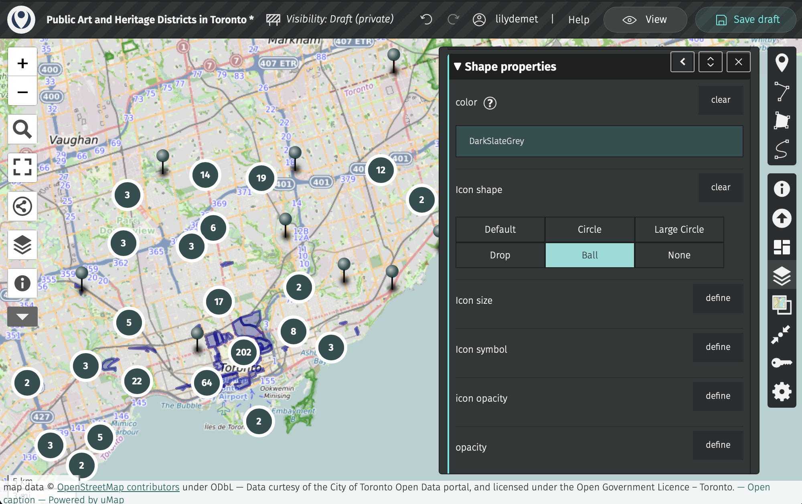


**save your map**

### Layer Interactivity 
Now, expand **Interaction options**. As it stands, if you click on any public art feature, you get a pop-up with the name of the layer. Let's change this so relevant details like Title, Artist, and the artwork image appear in the popup. 

Under Interaction options, expand the option **Popup content template**. If you click on the information icon, you'll see you can use "placeholders" to call the values of various attributes. What's currently there doesn't change anything because "name" and "description" don't refer to any column headings in Public Art - umap is case sensitive!!  

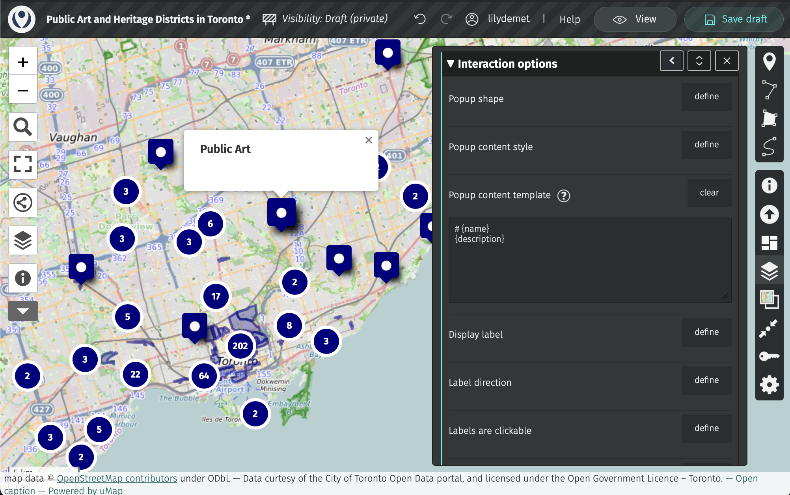

```
{Title}
{Artist}
ImageURL with three curly brackets on either side
```

Then, if you wanted to add labels to your Title and Artist, you 

```
**{Title}**
Artist: {Artist}
```

{{{ImageURL}}}
[[{link_url}|{{{ImageURL}}}]] 

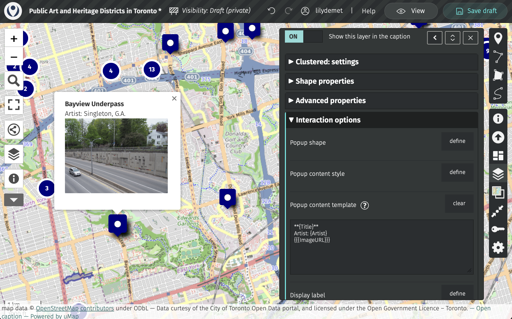


practice updating heritage districts. 


## Updating Basemap 
You can customoize your tile layers
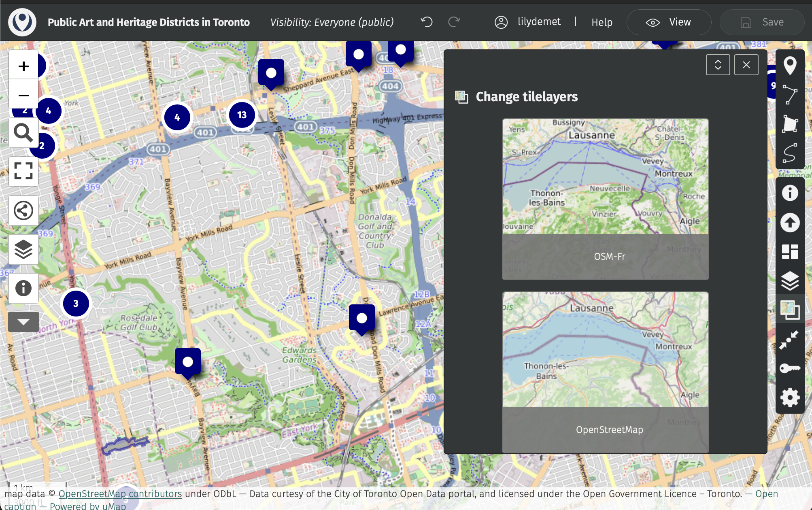

## Saving and Sharing your uMap

When you're happy with your web map, save your draft and change the visibility in the main banner menu at the top of your screen. 
Update visibility to Everyone then save your map. 


Then, head to the share icon in the left-hand menu.

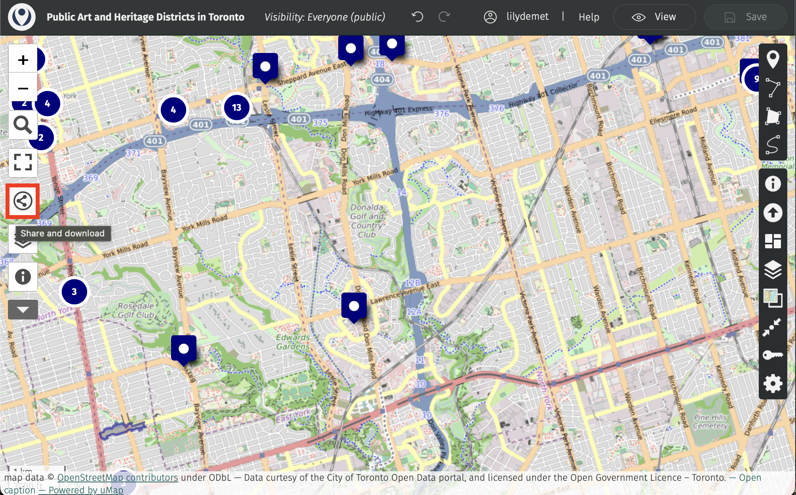

 Here you can get the link to share your map with others, the iframe information to embed it in another website, or even download the full code and data package of your map. That's the power of open-source! 


- share, embed, download - customomize embed too. 